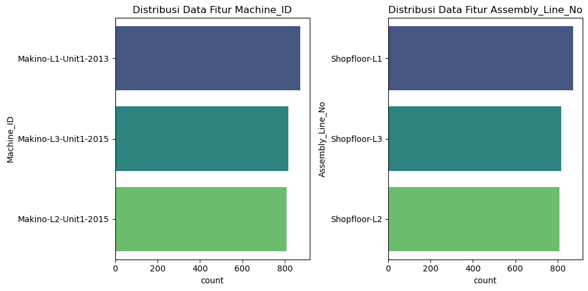
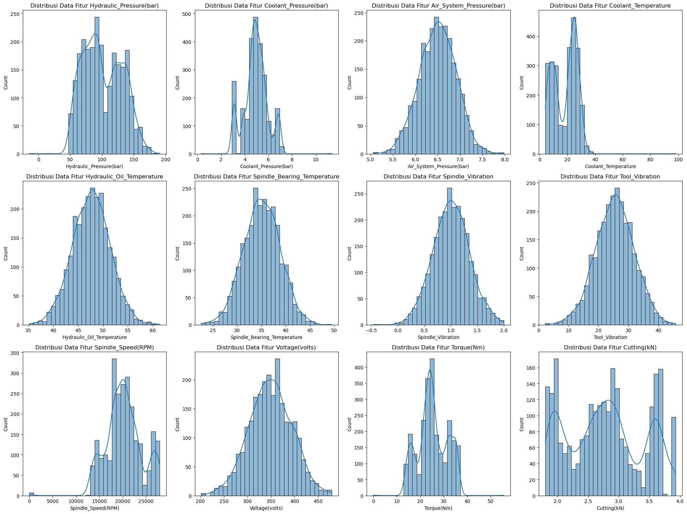
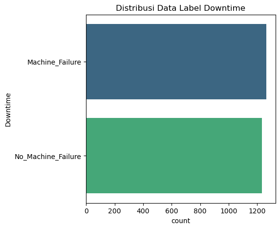
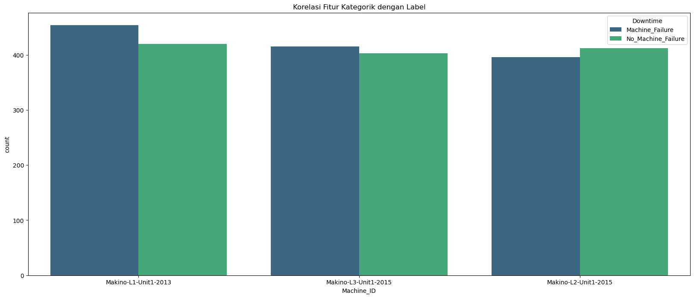
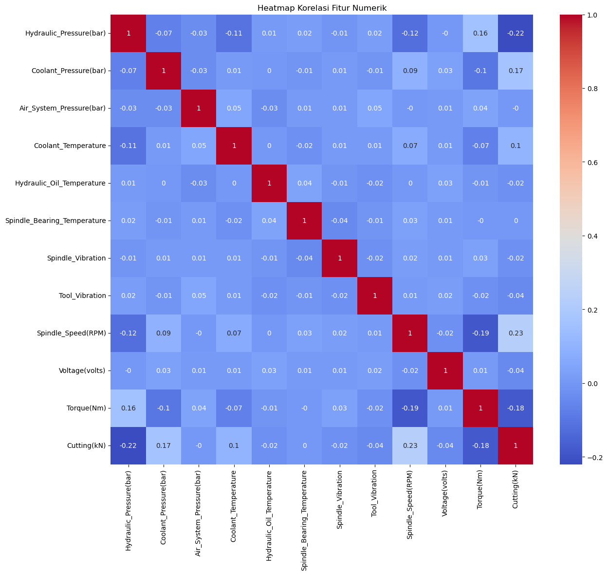
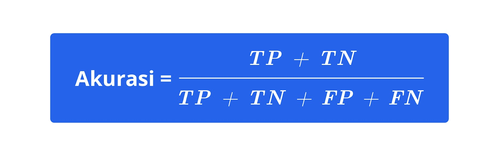

# Laporan Proyek Machine Learning - Mahendra Nabiha

## Domain Proyek

### Latar Belakang Masalah:
Persaingan global dalam industri manufaktur yang begitu banyak memberikan tekanan pada perusahaan-perusahaan manufaktur untuk terus meningkatkan kualitas produk dan meminimalkan biaya manufaktur produk tersebut. Hal tersebut dapat dilakukan dengan mengadopsi teknologi mutakhir yang tidak hanya untuk perampingan proses produksi, tetapi juga memastikan mesin produksi memiliki keandalan dan berumur panjang. Dengan memastikan mesin produksi berjalan dengan performa baik, produk yang dihasilkan akan memiliki kualitas baik dan ketepatan waktu dalam produksinya. Ketepatan waktu memproduksi produk dengan kualitas yang baik memberikan keunggulan tersendiri bagi perusahaan manufaktur yang sangat memperhatikan kinerja mesin produksinya.

### Alasan Masalah Terjadi:
Namun, dalam realita lapangan untuk memastikan mesin produksi bisa berkinerja baik, memiliki tantangan tersendiri yang harus diselesaikan. Tantangan tersebut adalah perbaikan pada mesin produksi. Perbaikan mesin produksi tidak serta merta memperbaiki mesin yang mengalami kerusakan. Pencegahan kerusakan juga harus dilakukan agar memastikan mesin tidak tetap rusak seiring berjalannya waktu. Apabila pencegahan kerusakan tidak dilakukan, maka bagian-bagian mesin akan terus bergantian rusak yang menimbulkan waktu henti produksi yang berkepanjangan. Bahkan, bagaimanapun memiliki perawatan dan perbaikan mesin yang terjadwal, tetap saja dapat menimbulkan waktu henti mesin yang tidak direncanakan. Pada akhirnya, biaya produksi membengkak dan kualitas produk yang tidak konsisten.

### Penyelesaian Masalah:
Oleh karena itu, adopsi teknologi mutakhir diperlukan agar memberikan solusi yang pasti untuk menyelesaikan permasalahan mesin tersebut. Teknologi mutakhir saat ini yang dikembangkan untuk menangani permasalahan tersebut adalah Machine Learning. Machine Learning telah banyak digunakan untuk membantu dalam pencegahan kerusakan mesin. Bahkan, melangkah lebih maju dari metode pencegahan kerusakan mesin yang sudah ada, seperti penjadwalan inspeksi, perawatan, dan perbaikan mesin. Machine Learning ini mempelajari pola kondisi mesin ketika mengalami kegagalan/kerusakan ataupun ketika tidak mengalami kegagalan berdasarkan hasil penjadwalan inspeksi dan perbaikan mesin yang telah dilakukan. Hasilnya, Machine Learning dapat memprediksi kapan mesin tersebut mengalami kegagalan. Hasil tersebut digunakan untuk melakukan perawatan yang lebih tepat, seperti pergantian bagian mesin yang benar-benar sebelum terjadi kerusakan/kegagalan bagian mesin tersebut. Hal ini akan berdampak pada meningkatnya produktivitas manufaktur dan efisiensi biaya produksi. 

### Referensi Penyelesaian Masalah:
Menurut Alam dkk. dalam penelitiannya yang berjudul [AI-Based Predictive Maintenance for U.S. Manufacturing: Reducing Downtime and Increasing Productivity](https://ijaeti.com/index.php/Journal/article/view/711?articlesBySimilarityPage=3) menjelaskan dengan melalui implementasi algoritma machine learning yang lebih lanjut, para produsen bisa secara akurat memprediksi kegagalan peralatan, memungkinkan intervensi tepat waktu yang mencegah waktu henti yang tidak direncanakan. Studi lainnya, dilakukan oleh Coandă dkk. yang berjudul [A state of the art of predictive maintenance techniques](https://iopscience.iop.org/article/10.1088/1757-899X/997/1/012039) dengan mengkaji penelitian-penelitian mengenai predictive maintenance dijelaskan bahwa solusi pemeliharaan prediktif yang diimplementasikan di lingkungan yang berbeda yang memiliki metode analisis sistem yang berbeda, menggunakan algoritma yang berbeda, tetapi memiliki tujuan yang sama, yaitu menentukan terobosan yang dapat memberikan manfaat jangka panjang yang diberikannya. Nilai tambah yang diberikan oleh cara-cara yang ditawarkan, menjadi titik awal bagi sistem dan metode pemeliharaan cerdas, seperti machine learning yang lebih unggul daripada praktik pemeliharaan lama.

### Alasan dan Harapan Proyek Ini Dilakukan:
Berdasarkan latar belakang, penyelesaian masalah, dan hasil penelitian, serta studi, maka penulis membuat proyek mengenai Pemeliharaan Prediktif pada Mesin CNC Berbasis Data Menggunakan Machine Learning Klasifikasi Terjadi Kegagalan Mesin atau Tidak Terjadi Kegagalan Mesin. Harapannya, dengan dibuatnya proyek ini, pemeliharan pada mesin CNC dapat memberikan peningkatan produktivitas, penurunan waktu henti, dan efisiensi biaya bagi perusahaan.

## Business Understanding

### Problem Statements:

Menjelaskan pernyataan masalah latar belakang:
- Model dengan algoritma apa yang dapat menghasilkan prediksi untuk semua mesin CNC? Hal ini memberikan informasi penentuan model machine learning dalam menggeneralisasi prediksi terjadi kegagalan atau tidak untuk semua mesin CNC guna efisien biaya produksi.

- Berdasarkan mesin CNC yang ada, apa saja mesin CNC yang mengalami kegagalan mesin? Hal ini memberikan informasi mesin CNC yang dikategorikan sebagai kegagalan mesin.

### Goal Statements:

Menjelaskan tujuan dari pernyataan masalah:
- Menghasilkan model prediksi untuk dapat digunakan di semua mesin CNC, dengan menemukan pola prediksi yang sama di semua mesin, sehingga dapat mengefisiensikan sumber daya untuk memproses model yang telah dibuat.

- Memprioritaskan mesin CNC untuk dilakukan perencanaan dan alokasi inspeksi, perawatan, dan perbaikan mesin lebih lanjut agar tidak mengganggu jalannya produksi.

### Solution Statements:

Cara untuk meraih goals:
- Menggunakan algoritma boosting, seperti LightGBM menggabungkan beberapa algoritma sederhana yang masih lemah menjadi sebuah algoritma yang kuat untuk meningkatkan performa dan akurasi model tinggi.

- Menggunakan algoritma bagging, seperti Random Forest dengan mencari voting hasil prediksi terbanyak untuk akurasi prediksi model tinggi.

## Data Understanding

### Informasi Dataset yang Digunakan:
Dataset yang digunakan adalah **Dataset Machine Downtime**. Dataset ini merupakan hasil pelaksanaan inspeksi, perawatan, dan perbaikan mesin CNC Makino yang berisi data fitur dan label dengan **jumlah data** untuk baris berjumlah 2500 baris, sedangkan untuk kolom berjumlah 16 kolom. Berdasarkan informasi dan statistika deskriptif, **kondisi dataset** terdapat fitur yang **masih memiliki missing value**, **tidak terdapat data duplikat**, dan **outliers yang masih dalam batas wajar**. File dataset bernama ```"machine_downtime.csv"```. Dataset ini dapat diunduh melalui **sumber tautan dengan mengklik kata Kaggle berikut**: [Kaggle](https://www.kaggle.com/datasets/srinivasanusuri/optimization-of-machine-downtime/data).

### Berikut ini uraian variabel-variabel atau fitur yang ada pada Dataset Machine Downtime:
- ```Date``` : hari pelaksanaan data diambil.
- ```Machine_ID``` : nomor identifikasi mesin CNC Makino.
- ```Assembly_Line_No``` : nomor identifikasi letak mesin CNC Makino berada.
- ```Hydraulic_Pressure(bar)``` : pengukuran tekanan sistem hidrolik dalam satuan bar.
- ```Coolant_Pressure(bar)``` : pengukuran tekanan sistem pendingin dalam satuan bar.
- ```Air_System_Pressure(bar)``` : pengukuran sistem udara bertekanan dalam satuan bar.
- ```Coolant_Temperature``` : pengukuran temperatur sistem pendingin dalam satuan celsius.
- ```Hydraulic_Oil_Temperature``` : pengukuran temperatur oli sistem hidrolik dalam satuan celsius.
- ```Spindle_Bearing_Temperature``` : pengukuran temperatur bearing pada spindle dalam satuan celsius.
- ```Spindel_Vibration``` : pengukuran vibrasi spindle dalam satuan mikrometer.
- ```Tool_Vibration``` : pengukuran vibrasi alat pemotong dalam satuan mikrometer.
- ```Spindle_Speed(RPM)``` : pengukuran putaran motor spindle dalam satuan RPM.
- ```Voltage(volts)``` : pengukuran suplai tegangan mesin dalam satuan volts
- ```Torque(Nm)``` : pengukuran torsi mesin dalam satuan Nm.
- ```Cutting(kN)``` : pengukuran gaya alat pemotong dalam satuan kN.
- ```Downtime``` : label indikator apakah mesin mengalami kegagalan atau tidak ketika hari pelaksanaan data diambil.

### Adapun tahapan yang dilakukan untuk memahami data lebih lanjut:
- **Exploratory Data Analysis - Univariate**. Pada tahap ini, dilakukan pengamatan terhadap fitur kategorik, fitur-fitur numerik, dan label mengenai distribusi datanya apakah terdistribusi normal atau tidak dan apakah bias ke salah satu kategorinya atau label. **Berikut ini hasil dari Exploratory Data Analysis - Univariate beserta hasil vilualisasi yang dilakukan**.


1. Berdasarkan **visualisasi distribusi data fitur kategorik** di atas, menunjukkan bahwa distribusi data fitur kategorik ```Machine_ID``` dan ```Assembly_Line_No``` memiliki jumlah data seimbang pada masing-masing kategorinya dan tidak bias ke salah satu kategorinya. Selain itu, terkait penomoran identifikasi pada fitur ```Assembly_Line_No``` dapat diwakilkan nilai kategorinya oleh fitur ```Machine_ID``` karena dalam penomoran idenifikasi pada fitur ```Machine_ID``` sudah termasuk nomor identifikasi yang ada pada fitur ```Assembly_Line_No```, yaitu nomor line. Oleh karena itu, jumlah fitur kategorik yang digunakan dalam pemodelan proyek machine learning ini menjadi satu fitur.


2. Berdasarkan **visualisasi distribusi data fitur numerik** di atas, menunjukkan bahwa distribusi data fitur ```Coolant_Temperature``` dan fitur ```Spindle_Speed(RPM)``` adalah distribusi data memiliki kecenderungan miring. Hal ini membuat kedua distribusi data fitur numerik tersebut tidak terdistribusi normal.



3. Berdasarkan **visualisasi distribusi data label** di atas, menunjukkan bahwa distribusi data label pada setiap label memiliki jumlah data yang seimbang, sehingga tidak ada label yang lebih dominan dari label lainnya.

- **Exploratory Data Analysis - Multivariate**. Pada tahap ini, dilakukan pengamatan terhadap korelasi fitur kategorik dengan label apakah sebaran datanya seimbang atau tidak dan korelasi fitur-fitur numeriknya apakah memiliki korelasi, bertentangan, atau tidak memiliki korelasi antara masing-masing kedua fitur numerik. **Berikut ini hasil dari Exploratory Data Analysis - Multivariate beserta hasil vilualisasi yang dilakukan**.


1. Berdasarkan **visualisasi korelasi fitur kategorik dengan label** di atas, menunjukkan bahwa sebaran data label pada masing-masing data fitur kategorik adalah seimbang, sehingga data tidak bias ke salah satu kategori fitur yang mana berpotensi hasil pemodelan machine learning dapat menggeneralisasi penggunaannya untuk semua mesin dengan nama brand yang sama. Korelasi fitur kategorik dengan label dilakukan karena tipe data dari label sendiri berupa tipe data kategorik, sehingga korelasi fitur dengan label dilakukan menyesuaikan tipe data dari labelnya.



2. Berdasarkan **visualisasi korelasi fitur numerik** di atas, menunjukkan bahwa korelasi antara kedua fitur numerik tidak ada yang memiliki korelasi kuat maupun bertentangan. Hal ini menunjukkan semua fitur numerik berkontribusi secara independen atau tidak bergantung satu sama lain.

## Data Preparation

### Proses Data Preparation yang Dilakukan:
1. **Tahapan Menangani Missing Value**, mengidentifikasi dan menangani kolom yang memiliki missing value. Hal ini dilakukan agar tidak ada data kolom yang tidak teridentifikasi pada saat menghasilkan prediksi. Berdasarkan identifikasi missing value pada setiap kolom DataFrame, menunjukkan kolom yang memiliki missing value merupakan kolom numerik. Oleh karena itu, dilakukan mengisi missing value dengan nilai median masing-masing kolom yang memiliki missing value.

2. **Tahapan Menangani Duplikasi Data**, mengidentifikasi dan menangani duplikasi data. Hal ini dilakukan untuk memastikan tidak ada salinan data yang sama persis yang akan menghasilkan data yang bias. Berdasarkan identifikasi data duplikat dalam DataFrame, menunjukkan tidak ada data duplikat dalam DataFrame, maka tidak memerlukan penanganan duplikasi data pada DataFrame.

3. **Tahapan Menangani Outliers**, mengidentifikasi dan menangani kolom yang memiliki outliers. Hal ini dilakukan untuk memastikan nilai pada kolom ```Hydraulic_Pressure(bar)```, ```Coolant_Pressure(bar)```, ```Air_System_Pressure(bar)```, ```Coolant_Temperature```, ```Hydraulic_Oil_Temperature```, ```Spindle_Bearing_Temperature```, ```Spindle_Vibration```, ```Tool_Vibration```, ```Spindle_Speed(RPM)```, ```Voltage(volts)```, ```Torque(Nm)```, dan ```Cutting(kN)``` masih dalam batas wajar. Berdasarkan identifikasi outliers pada kolom numerik DataFrame, menunjukkan bahwa terdapat outliers yang masih wajar untuk diidentifikasi sebagai pencatatan nilai pengukuran sesungguhnya yang dilakukan di lapangan. Oleh karena itu, tidak ada penanganan outliers. Pada kolom ```Hydraulic_Pressure(bar)``` terdapat data yang memiliki outlier dengan nilai negatif. Data nilai negatif tersebut berbeda dengan kolom lainnya yang datanya dalam satuan bar. Namun, nilai tersebut menunjukkan nilai tekanan hidrolik pada saat itu berada di bawah nilai tekanan atmosfer, bukan nilai dari kesalahan penulisan data.

4. **Tahapan Verifikasi Tipe Data**, mengidentifikasi dan menangani tipe data kolom yang tidak sesuai dan menghapus kolm yang tidak digunakan sebagai fitur. Hal ini dilakukan untuk memastikan data yang dibutuhkan telah sesuai. Terjadi perubahan data, yaitu mengisi missing value dengan nilai median masing-masing kolom yang terdapat missing value dan mengubah tipe data kolom ```Date``` menjadi datetime. Kolom ```Date``` tidak digunakan sebagai fitur karena solusi permasalahan dalam proyek machine learning ini adalah klasifikasi, bukan time series atau forcasting.

5. **Melakukan normalisasi pada fitur-fitur numerik**, dengan mengubah rentang nilai menjadi 0 hingga 1 pada masing-masing fitur-fitur numerik. Hal ini dilakukan karena distribusi data fitur-fitur numerik ada yang tidak terdistribusi normal dan memastikan bahwa semua fitur numerik berada dalam rentang yang sama agar dapat meningkatkan performa dalam pemodelan machine learning nantinya.

6. **Melakukan encoding label pada fitur kategorik**, dengan mengubah tipe data menjadi numerik dengan rentang nilai tertentu menyesuaikan interpretasi jumlah kategori dalam fitur kategorik tersebut. Hal ini dilakukan karena mempermudah proses pemodelan machine learning terhadap fitur-fitur yang ada, baik terhadap perhitungan statistika maupun memori yang digunakan dikarenakan tidak menambah dimensi fitur kategorik apabila dibandingkan dengan penggunaan one-hot encoding yang akan menambah memori dalam pemrosesan pemodelan machine learning-nya.

7. **Melakukan splitting data**, dengan membagi komposisi train set sebesar 80% dan test set sebesar 20%. Komposisi tersebut ideal digunakan untuk melakukan proses pemodelan machine learning. Hal tersebut dilakukan karena membantu menggeneralisasi pemodelan machine learning yang akan digunakan dan memungkinkan melakukan proses pemodelan machine learning secara adil terhadap bagian-bagian data, sehingga model yang dihasilkan tidak bias kepada satu hingga beberapa bagian data saja. 

## Model Development

### Tahapan Model Development yang pertama dilakukan adalah Model Training, yaitu melakukan pelatihan model menggunakan algoritma sebagai berikut:
1. **Random Forest**, algoritma yang menggunakan metode ensembel, menggabungkan model-model individual menjadi model akhir yang digabungkan. Algoritma ini menggunakan teknik pendekatan bagging, yaitu melatih model-model individual secara paralel atau bersamaan.
- **Parameter yang digunakan dan diperhatikan**, yaitu ```random_state``` memungkinkan melatih model akhir dari melatih beberapa sampel model secara acak, independen, dan paralel. Selain itu, parameter lain yang perlu diperhatikan, secara default adalah ```n_estimators``` dengan nilai 100, artinya memiliki sampel model berjumlah 100 yang dilatih untuk digabungkan menjadi model akhir.
- **Kelebihan dari algoritma ini** adalah mengurangi resiko overfitting pada model yang dihasilkan. Hal tersebut dapat terjadi karena algoritma Random Forest melatih sampel model secara acak dan paralel, sehingga tidak mampu menangkap data latih lebih mendalam, yang bisa memungkinkan akurasi model terhadap data latih tinggi, namun akurasi prediksi model terhadap data tes akan lebih rendah dibandingkan terhadap data latihnya.
- **Kekurangan dari algoritma ini** adalah  waktu yang diperlukan untuk melatih model lebih lambat karena jumlah sampel model yang ditentukan besar dan jumlah data latih yang digunakan tegolong banyak.

2. **Light Gradient Boosting Machine (LGBM)**, algoritma yang menggunakan metode ensembel dengan teknik pendekatan boosting, pelatihan secara bertahap yang berarti memungkinkan sampel model berikutnya mencoba untuk memperbaiki kesalahan sampel model sebelumnya.
- **Parameter yang digunakan dan diperhatikan**, yaitu ```random_state``` memungkinkan melatih model akhir dari melatih beberapa sampel model secara acak, dependen, dan bertahap. Parameter lainnya secara default, seperti ```max_depth``` bernilai -1 yang berarti tidak ada batas untuk melatih model hingga memiliki kompleksitas tinggi. Berbeda dengan Random Forest yang mana parameter ```max_depth``` secara default diatur tidak ada.
- **Kelebihan dari algoritma ini** adalah waktu yang diperlukan untuk melatih model lebih cepat karena algoritma ini dikembangkan untuk meringankan penggunaan ruang dan memori, sehingga algoritma ini dapat menangani data yang besar yang mana berdampak pada penggunaan memori yang banyak dan kecepatan yang semakin melambat.
- **Kekurangan dari algoritma ini** adalah lebih rentan terhadap overfitting karena pengaturan parameter ```max_depth``` yang memungkinkan melatih model lebih mendalam lagi yang bisa menangkap data latih noise, seperti outliers.

### Tahapan Model Development yang terakhir dilakukan adalah Best Model Selection, yaitu memilih model terbaik sebagai solusi berdasarkan analisis Model Training:
- Berkaitan dengan kerentanan algoritma LGBM terhadap overfitting, proyek ini menggunakan dataset yang terdapat outliers yang tidak perlu ditangani karena pengambilan data tersebut, langsung melalui pengamatan membaca nilai pengukuran di lapangan, tidak ada kesalahan penulisan data yang terjadi. Oleh sebab itu, kekurangan yang dimiliki oleh LGBM mengenai rentan terhadap overfitting, tidak dipermasalahan dalam proyek ini.

- Dengan demikian, berdasarkan uraian wawasan mengenai kelebihan dan kekurangan setiap algoritma, algoritma LGBM menjadi algoritma dalam model dengan solusi terbaik untuk proyek ini dikarenakan kelebihannya waktu yang dibutuhkan dalam pelatihan model yang lebih cepat dibandingkan dengan algoritma Random Forest dan kekurangan LGBM yang tidak perlu diatasi lebih lanjut, dibandingkan kekurangan Random Forest yang mana sudah teratasi dengan menggunakan algoritma LGBM.

## Evaluation

###  Metrik yang digunakan untuk evaluasi pemodelan machine learning klasifikasi adalah Confussion Matrix dan Classification Report yang mana terdiri dari metrik akurasi, precision, recall, dan f1-score dengan penjelasan lebih lanjut sebagai berikut.
- **Akurasi**, mengukur kinerja model dengan menghitung proporsi dari prediksi, baik positif maupun negatif yang benar. 

**Formula perhitungan untuk akurasi** adalah penjumlahan total data True Positive (total data dengan hasil prediksi label adalah Machine_Failure dan aktual label adalah Machine_Failure) dengan total data True Negative (total data dengan hasil prediksi label adalah No_Machine_Failure dan aktual label adalah No_Machine_Failure), selanjutnya dibagi dengan penjumlahan total data True Positive dengan total data True Negatif, dengan total data False Positive (total data dengan hasil prediksi label adalah No_Machine_Failure dan aktual label adalah Machine_Failure) dengan total data False Negative.

- **Precision**, mengukur seberapa baik model menghindari hasil prediksi label No_Machine_Failure terhadap aktual label Machine_Failure. 

**Formula perhitungan untuk precision** adalah total data True Positive, selanjutnya dibagi dengan penjumlahan total data True Positive dengan total data False Positive.

- **Recall**,  mengukur seberapa baik model dapat menangkap semua prediksi positif atau berlabel Machine_Failure. 

**Formula perhitungan untuk recall** adalah total data True Positive, selanjutnya dibagi dengan penjumlahan total data True Positive dengan total data False Negative.

- **F1-Score**, mengukur penggabungan precision dan recall menjadi satu metrik tunggal yang mempertimbangkan gabungan metrik keduanya. 

**Formula perhitungan untuk f1-score** adalah 2 dikali pembagian antara perkalian precision dan recall dengan penjumlahan precision dan recall.

### Hasil Evaluasi terhadap 2 Algoritma Menggunakan Metrik Confussion Matrix dan Classification Report adalah berikut:
1. **Random Forest** mendapatkan skor **akurasi** 0.99 dengan skor masing-masing label:
- **Machine_Failure** mendapatkan skor **precision** 0.99, skor **recall** 0.98, dan **f1-score**  0.99.
- **No Macine_Failure** mendapatkan skor **precision** 0.99, skor **recall** 0.99, dan **f1-score**  0.99.
2. **Light Gradient Boosting Machine** mendapatkan skor **akurasi** 0.99 dengan skor masing-masing label:
- **Machine_Failure** mendapatkan skor **precision** 0.98, skor **recall** 0.99, dan **f1-score**  0.99.
- **No Macine_Failure** mendapatkan skor **precision** 0.99, skor **recall** 0.99, dan **f1-score**  0.99.

Berdasarkan evaluasi model menggunakan algoritma Random Forest dan LGBM, menunjukkan perbedaan skor yang didapatkan untuk label ```"Machine_Failure"```, yaitu pada Random Forest mendapatkan skor presisi 0.99 dan skor recall 0.98, sedangkan pada LGBM mendapatkan skor presisi 0.98 dan skor recall 0.99. Untuk menjelaskan lebih dalam mengenai pemilihan model menggunakan algoritma LGBM sebagai solusi terbaik, dengan pertimbangan mencari seberapa baik model menghindari hasil prediksi label No_Machine_Failure terhadap aktual label Machine_Failure adalah algoritma LGBM dikarenakan skor recall yang menjadi pertimbangan tersebut lebih tinggi dibandingkan dengan algoritma Random Forest.

### Hasil Evaluasi Berdasarkan Business Understanding:
- **Problem Statement** 
1. Model dengan algoritma Light Gradient Boosting Machine (LGBM) dapat menghasilkan prediksi untuk semua mesin CNC dikarenakan kelebihannya waktu yang dibutuhkan dalam pelatihan model yang lebih cepat dan mampu menghindari hasil prediksi label No_Machine_Failure terhadap aktual label Machine_Failure.
2. Mesin yang mengalami kegagalan, yaitu Makino-L2-Unit1-2015 dengan hasil prediksi yang dilakukan oleh model adalah ```Machine_Failure```.

- **Goal Statement**
1. Tujuan yang dicapai pertama adalah menghasilkan model yang menggunakan algoritma LGBM untuk dapat digunakan di semua mesin CNC dengan waktu yang lebih cepat, sehingga dapat mengefisiensikan sumber daya untuk proses prediksinya.
2. Tujuan yang dicapai kedua adalah mesin Makino-L2-Unit1-2015 diprioritaskan untuk segera dilakukan perencanaan, inspeksi, perawatan, dan perbaikan lebih lanjut.

- **Solution Statement**
Berdasarkan hasil model training menggunakan algoritma boosting, seperti LGBM dan hasil model training menggunakan algoritma bagging, seperti Random Forest, menunjukkan perbandingan kelebihan dan kekurangan, serta hasil evaluasi untuk memilih model yang menjadi solusi terbaik untuk proyek ini. Hasil perbandingan tersebut adalah model dengan menggunakan algoritma boosting, yaitu LGBM menjadi solusi terbaik untuk dapat memprediksi semua mesin CNC yang mengalami kegagalan atau tidak, mempercepat proses prediksi yang dilakukan, dan memberikan saran mesin yang diprioritaskan untuk segera dilakukan rangkaian penanganan mesin. Hasil tersebut terbukti dapat melakukan prediksi pada semua mesin CNC yang lebih cepat dan memberikan hasil prediksi mesin yang mengalami kegagalan, yaitu mesin Makino-L2-Unit1-2015.

**---Ini adalah bagian akhir laporan---**

_Catatan:_
- _Anda dapat menambahkan gambar, kode, atau tabel ke dalam laporan jika diperlukan. Temukan caranya pada contoh dokumen markdown di situs editor [Dillinger](https://dillinger.io/), [Github Guides: Mastering markdown](https://guides.github.com/features/mastering-markdown/), atau sumber lain di internet. Semangat!_
- Jika terdapat penjelasan yang harus menyertakan code snippet, tuliskan dengan sewajarnya. Tidak perlu menuliskan keseluruhan kode project, cukup bagian yang ingin dijelaskan saja.

